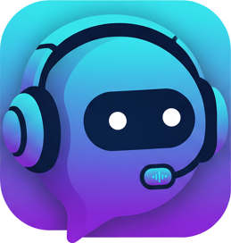

<p align="center">
  
</p>

# wecordy.js

Wecordy platformu için geliştirilmiş, yüksek performanslı bot kütüphanesi.
TypeScript ekosisteminde kurumsal standartlarda, ölçeklenebilir ve güvenli botlar geliştirmenize olanak tanır.

[](https://www.npmjs.com/package/@wecordy/core)
[](https://github.com/wecordy/wecordy.js)
[](https://github.com/wecordy/wecordy.js/blob/main/LICENSE)
[](https://www.npmjs.com/package/@wecordy/core)

> [!IMPORTANT]
> Bu kütüphane şu anda **Beta** aşamasındadır. API yapısında geliştirmeler devam etmektedir; bu süreçte breaking change'ler (kırıcı değişiklikler) yaşanabilir.

## 🚀 Öne Çıkan Özellikler

- **Full TypeScript Desteği:** Güçlü tip tanımlamaları ve IntelliSense desteği.
- **Gelişmiş Mimari:** Manager ve Cache mimarisi ile optimize edilmiş veri yönetimi.
- **Dinamik Slash Komutları:** Dahili builder yapısı ile kolay komut kaydı ve yönetimi.
- **Gelişmiş Cache:** Sunucu, kanal, mesaj ve üye verileri için optimize edilmiş bellek yönetimi.
- **Sesli Kanal ve Müzik Desteği:** WebRTC tabanlı sesli bağlantı ve yt-dlp ile yüksek performanslı müzik yayını.
- **Event-Driven:** WebSocket tabanlı gerçek zamanlı olay yönetimi.

Wecordy.js, WebRTC kullanarak düşük gecikmeli ses iletimi sağlar. Hem YouTube üzerinden canlı yayın (streaming) hem de yerel WebM/Opus dosyalarını oynatmayı destekler.

### YouTube Desteği
YouTube üzerinden müzik çalmak için sisteminizde `yt-dlp` kurulu olmalıdır:

```bash
# macOS
brew install yt-dlp

# Windows (winget)
winget install yt-dlp

# Linux (Ubuntu/Debian)
sudo apt install yt-dlp
```

### Kod Örnekleri

```typescript
// YouTube üzerinden oynatma
connection.playUrl('https://www.youtube.com/watch?v=...');

// Yerel dosyadan oynatma (WebM/Opus)
connection.play('./music/song.webm');
```

## 📦 Kurulum

```bash
npm install @wecordy/core
# veya
yarn add @wecordy/core
```

## 📖 Hızlı Başlangıç

### Temel Bot Kurulumu

```typescript
import { Client, Events, GatewayIntentBits } from '@wecordy/core';

const client = new Client({
  intents: [GatewayIntentBits.Servers, GatewayIntentBits.ServerMessages, GatewayIntentBits.MessageContent],
});

client.on(Events.ClientReady, (readyClient) => {
  console.log(`🚀 ${readyClient.user?.username} olarak başarıyla giriş yapıldı!`);
});

// Gelen mesajları dinleme
client.on(Events.MessageCreate, async (message) => {
  // Botun kendi mesajlarını görmezden gel
  if (message.isOwnMessage()) return;

  if (message.content === '!ping') {
    await message.reply('Pong! 🏓');
  }
});

client.login('YOUR_BOT_TOKEN');
```

### Slash Komutlarını Kullanma

```typescript
import { Client, Events, SlashCommandBuilder } from '@wecordy/core';

const client = new Client();

// Komut Tanımlama
const pingCommand = new SlashCommandBuilder().setName('ping').setDescription('Botun gecikme süresini ölçer');

const selamCommand = new SlashCommandBuilder()
  .setName('selam')
  .setDescription('Kullanıcıyı selamlar')
  .addStringOption((opt) => opt.setName('isim').setDescription('Kiminle selamlaşalım?').setRequired(true));

client.on(Events.ClientReady, async (readyClient) => {
  // Komutları global olarak kaydet
  await client.application?.commands.set([pingCommand, selamCommand]);
  console.log('Slash komutları hazır!');
});

// Interaction Handling
client.on(Events.InteractionCreate, async (interaction) => {
  if (!interaction.isCommand()) return;

  const commandName = interaction.commandName();

  if (commandName === 'ping') {
    await interaction.reply('Pong! 🏓');
  }

  if (commandName === 'selam') {
    const isim = interaction.getString('isim', true);
    await interaction.reply(`Selam ${isim}!`);
  }
});

client.login('YOUR_BOT_TOKEN');
```

## 🏗️ Mimari Yapı

`wecordy.js`, verimlilik ve ölçeklenebilirlik için katmanlı bir mimari kullanır:

| Bileşen        | Görevi                                                         |
| :------------- | :------------------------------------------------------------- |
| **Client**     | Ana kontrol merkezi ve event dispatcher.                       |
| **Managers**   | Varlıkların (Server, Channel vb.) yönetimi ve cache işlemleri. |
| **Structures** | API verilerinin zenginleştirilmiş nesne modelleri.             |
| **Collection** | Filtreleme ve arama desteği sunan gelişmiş Map yapısı.         |
| **REST/WS**    | API iletişimi ve WebSocket gateway yönetimi.                   |

## 📋 Temel Olaylar (Events)

| Event               | Tetiklenme Durumu                                   |
| :------------------ | :-------------------------------------------------- |
| `ClientReady`       | Bot başarıyla bağlanıp hazır olduğunda.             |
| `MessageCreate`     | Herhangi bir kanalda mesaj gönderildiğinde.         |
| `InteractionCreate` | Bir Slash komutu kullanıldığında.                   |
| `ServerCreate`      | Bot yeni bir sunucuya katıldığında.                 |
| `ServerMemberAdd`   | Bir kullanıcı sunucuya katıldığında.                |
| `Error`             | Kritik bir hata oluştuğunda (Bağlantı kopması vb.). |

## ⚙️ Yapılandırma

```typescript
const client = new Client({
  intents: ['Servers', 'ServerMessages'],
});
```

## 🔧 Gereksinimler

- **Node.js:** v18.0.0 or higher
- **TypeScript:** v5.0+ (opsiyonel ancak tavsiye edilir)
- **yt-dlp:** YouTube streaming için gereklidir

## 💡 Örnek Kullanım

Kütüphanenin tüm özelliklerini (müzik komutları dahil) içeren detaylı bir örnek için [example](example/index.ts) klasörüne göz atabilirsiniz.

## 📄 Lisans

Bu proje **MIT** lisansı altında lisanslanmıştır. Daha fazla bilgi için `LICENSE` dosyasına göz atın.

---

Developed with ❤️ by **Wecordy Team**
